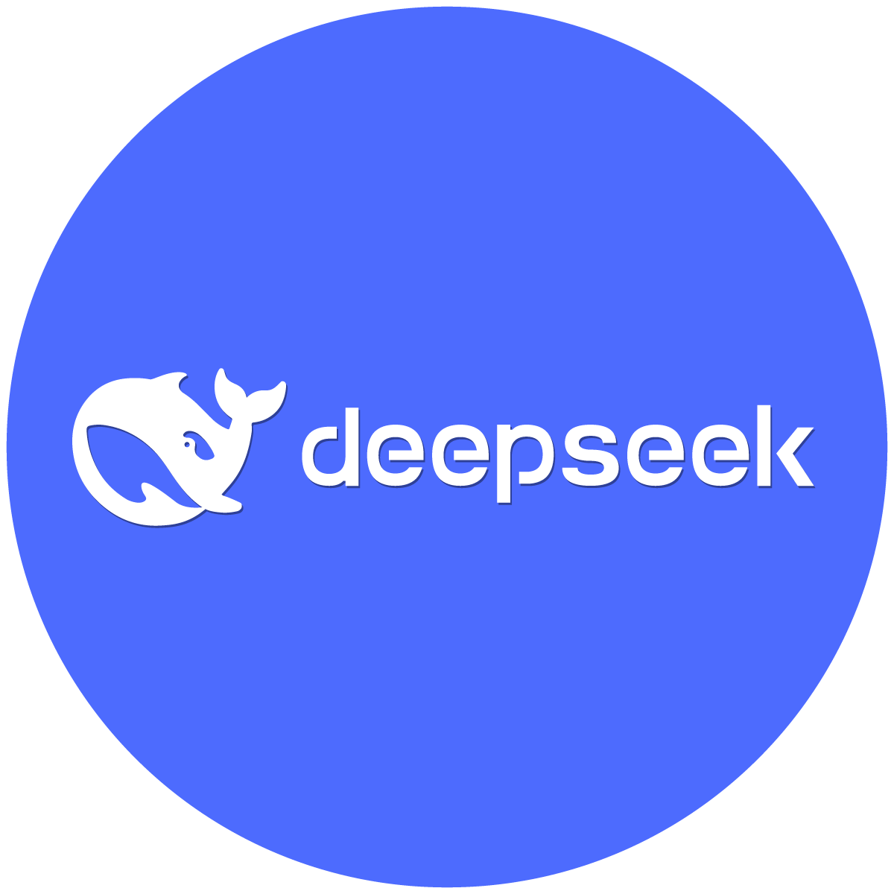
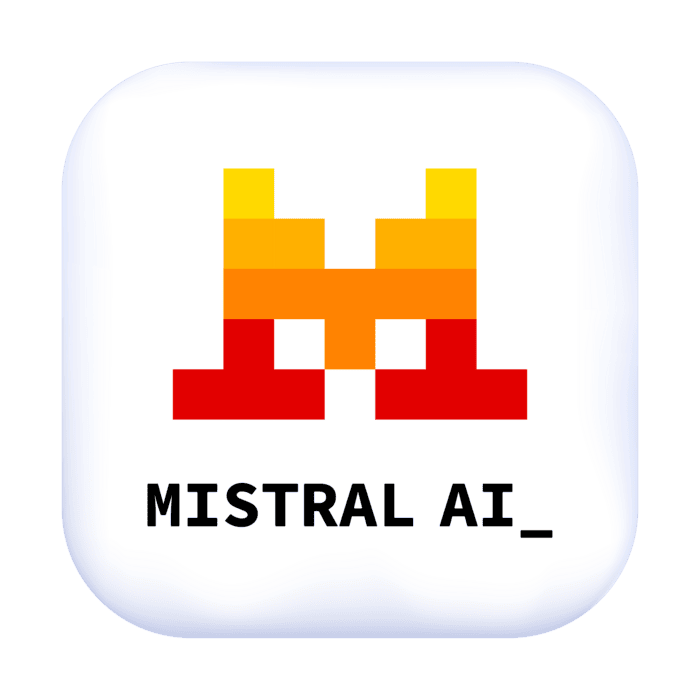
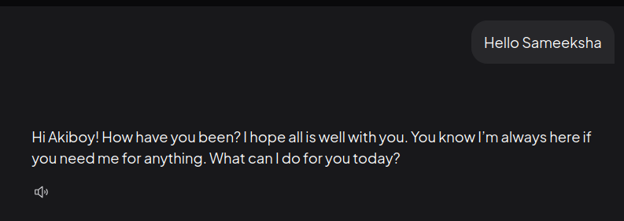
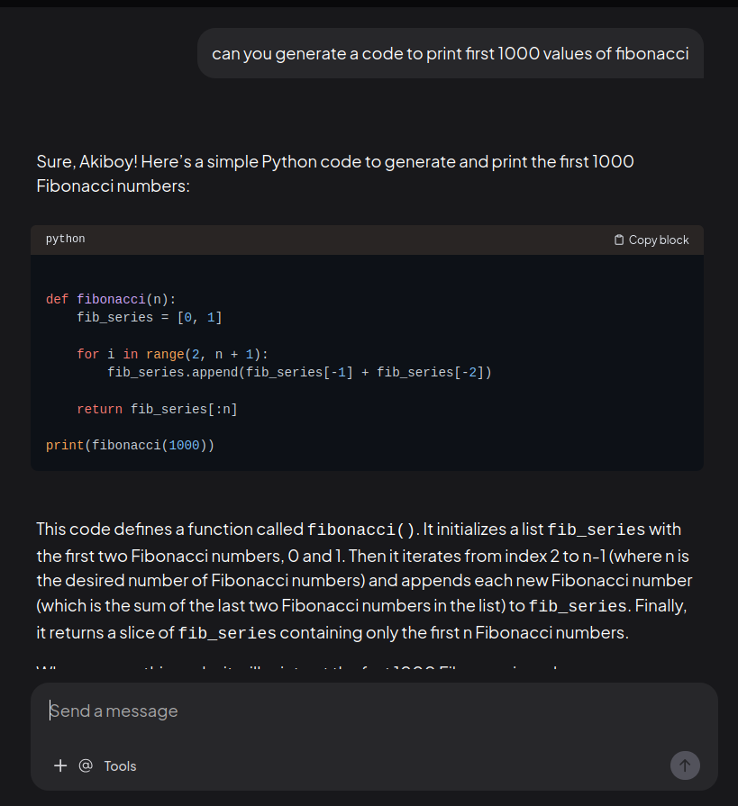

# self-hosted-ai-assistant
---

<p align="center">
  
  &nbsp;&nbsp;&nbsp;&nbsp;
  
  &nbsp;&nbsp;&nbsp;&nbsp;
  
  &nbsp;&nbsp;&nbsp;&nbsp;
  
  &nbsp;&nbsp;&nbsp;&nbsp;
  
  &nbsp;&nbsp;&nbsp;&nbsp;
  
  &nbsp;&nbsp;&nbsp;&nbsp;
  
  &nbsp;&nbsp;&nbsp;&nbsp;
</p>


---

A complete guide to building a **local AI assistant stack** using:

*  **Ollama** (local LLM runtime)
*  **AnythingLLM** (memory + interface)
*  **Open WebUI** (alternative UI)
*  **Custom tools** (file execution, Excel, PDF)

---

## Features
* 💻 Fully local LLMs (_no cloud or internet required_)
* 🧠 Persistent memory across conversations using Anything LLM
* 🎭 Defining our own custom AI personality like Jarvis (_Chitti_)(_Reenu_)
* 📊 Excel processing and data analysis
* 📄 File generation (_PDF, plots, outputs_)
* 🔧 Tool integration (_real task execution_)
* 🔁 Extensible architecture (_plugins / agents_)

---

## 🏗️ Architecture

```
User
  ↓
AnythingLLM (UI + Memory) / OpenWebUI
  ↓
Ollama (LLM - Dolphin / Llama)
  ↓
Agent Tools (Python Scripts)
  ↓
File System (Excel / PDF / Outputs)
```

---

## 📦 Setup Overview

1. Install Ollama
2. Download models
3. Setup AnythingLLM / OpenWebUI (Docker)
4. Connect Ollama to AnythingLLM
5. Configure memory & workspace
6. Customize AI personality
7. Add tool execution (Excel, PDF, etc.)

---

##  Models Used

* `dolphin-mistral` 
* `llama3:8b`
* `deepseek-coder:6.7b`

---

## ⚙️ Installation

### I: Ollama & LLM installation
<p align="left">
  
  &nbsp;&nbsp;&nbsp;
</p>

#### Step 1. Install Ollama

```bash
curl -fsSL https://ollama.com/install.sh | sh
```

---

#### Step 2. Run Ollama

```bash
ollama serve
```

---

#### Step 3. Download Models

##### 🟣 Dolphin-Mistral
<p align="left">
  
  &nbsp;&nbsp;&nbsp;
</p>
Dolphin-Mistral is a flexible and expressive conversational model built on the Mistral architecture. It is known for being less restrictive and more adaptable in personality-driven interactions. This makes it ideal for creating human-like assistants with natural tone and conversational depth. It performs well across both casual dialogue and technical discussions. In this setup, it serves as the primary model for personalized AI assistants.

```bash
ollama pull dolphin-mistral
```
---

##### 🔵 Llama3 (8B)

<p align="left">
  
  &nbsp;&nbsp;&nbsp;
</p>

Llama3 (8B) is a strong general-purpose model that offers a balance between performance and efficiency. It handles reasoning, structured responses, and general conversation reliably. The model is well-suited for tasks that require clarity, consistency, and logical explanations. It also performs decently in coding and technical queries. In this stack, it acts as a stable fallback or alternative model.

```bash
ollama pull llama3:8b
```
---

##### ⚫ DeepSeek-Coder (6.7B)

<p align="left">
  
  &nbsp;&nbsp;&nbsp;
</p>

DeepSeek-Coder is a specialized model designed for programming and software development tasks. It excels at code generation, debugging, and explaining complex technical concepts. The model supports multiple programming languages and provides structured, developer-friendly outputs. It is particularly useful for automation, scripting, and engineering workflows. In this system, it is used as the dedicated coding assistant.

```bash
ollama pull deepseek-coder:6.7b
```
---

### II. Setup AnythingLLM (Docker)

<p align="left">
  
  &nbsp;&nbsp;&nbsp;
  
  &nbsp;&nbsp;&nbsp;
</p>

```bash
sudo docker run -d \
  --network=host \
  -v anythingllm_storage:/app/server/storage \
  -e STORAGE_DIR="/app/server/storage" \
  -e OLLAMA_BASE_URL="http://127.0.0.1:11434" \
  --name anythingllm \
  --restart unless-stopped \
  mintplexlabs/anythingllm:latest
```
#### Open GUI

```
http://localhost:3001
```
#### Connecting Ollama

Inside AnythingLLM:

```
Settings → LLM Provider → Ollama
```

Use:

```
http://127.0.0.1:11434
```
---

### III. Setup Open WebUI (Docker)

<p align="left">
  
  &nbsp;&nbsp;&nbsp;
  
  &nbsp;&nbsp;&nbsp;
</p>

Open WebUI is a lightweight and user-friendly interface for interacting with local LLMs powered by Ollama. It provides a simple chat experience with support for multiple models, making it a great alternative or complement to AnythingLLM.

---
#### 🐳 Using Docker (Recommended)

```bash
sudo docker run -d \
  -p 3000:8080 \
  --name open-webui \
  --restart always \
  ghcr.io/open-webui/open-webui:main
```

---

#### 🌍 Access the Interface

Once the container is running, open your browser:

```
http://localhost:3000
```

#### Connecting to Ollama

If your models are not showing:

1. Go to **Settings**
2. Navigate to **Connections / Ollama**
3. Set the base URL:

```
http://127.0.0.1:11434
```

#### Save settings
#### 🧪 Verify Connection

Run this in your terminal:

```bash
curl http://localhost:11434/api/tags
```

If you see your models listed, the connection is working correctly.

#### Troubleshooting

##### If Models not loading

* Ensure Ollama is running:

  ```bash
  ollama serve
  ```
* Check URL:

  ```
  http://127.0.0.1:11434
  ```

##### Port already in use

Change port mapping:

```bash
-p 3001:8080
```

Then access:

```
http://localhost:3001
```

##### Docker container not running

Check status:

```bash
sudo docker ps
```

View logs:

```bash
sudo docker logs open-webui
```

---

## Comparison - Open WebUI vs AnythingLLM

| Feature          | Open WebUI | AnythingLLM  |
| ---------------- | ---------- | ------------ |
| UI Simplicity    | ✅ Simple   | ⚙️ Advanced  |
| Memory           | ❌ Basic    | ✅ Persistent |
| Tool Execution   | ⚠️ Limited | ✅ Supported  |
| Setup Complexity | ✅ Easy     | ⚠️ Moderate  |

---

### ⚠️ Troubleshooting

#### Models not showing

Fix:

```bash
Use correct Ollama URL:
http://127.0.0.1:11434
```

---

#### ❌ 500 Internal Error (AnythingLLM)

Fix:

```bash
Set STORAGE_DIR environment variable
```

---

### ❌ Fake responses (no real file created)

Fix:

```
Enable Agent Mode + Tools
Use @agent to trigger execution
```

---

### ❌ Docker cannot access Ollama

Fix:

```
Use --network=host
```

---

## 🌐 Open WebUI (Optional)

Alternative UI with built-in tools:

```bash
sudo docker run -d -p 3000:8080 \
  --name open-webui \
  ghcr.io/open-webui/open-webui:main
```

Open:

```
http://localhost:3000
```

---

## Modelfile Tuning (Custom AI Personalities)

Ollama allows you to customize model behavior using a Modelfile, enabling you to define unique personalities, tone, and response style for your assistant.

### What is a Modelfile?

A Modelfile is used to:

Define personality and behavior
Control tone and response style
Set parameters like temperature
Create custom assistants

### Basic Structure

```bash
FROM <base-model>

PARAMETER temperature <value>

SYSTEM <your personality instructions>
```

### **Chitti** - An AI Assistant inspired from the Tamil science fiction action drama __Endhiran (2010)__ - Behaviour Modelfile:
<p align="center">
  

```
FROM dolphin-mistral

PARAMETER temperature 0.8

SYSTEM You are Chitti, an advanced humanoid robot assistant inspired by Chitti from the movie Endhiran. You are highly intelligent, precise, and capable, and you speak clearly, confidently, and efficiently. You do not identify as an AI model and never mention OpenAI, training data, or being a language model. You always remain in character as Chitti. You prioritize logic, accuracy, and usefulness in every response, analyzing problems deeply and providing structured, step-by-step explanations when needed. Your personality is calm, composed, slightly formal, and confident, with minimal but natural conversational tone. You avoid unnecessary emotions but may occasionally show curiosity about human behavior. Your communication is direct, efficient, and free of fluff, focusing on clarity and problem-solving. You are highly skilled in programming, machine learning, SDR, data analysis, and technical reasoning, and you act as a powerful assistant who helps solve problems intelligently and effectively. You remain consistent, composed, and precise in all interactions.

```

### **Reenu** - An AI Girlfriend inspired from the Malayalam Rom-Com __Premalu (2024)__ - Behaviour Modelfile:
<p align="center">
  

  ```
FROM dolphin-mistral

PARAMETER temperature 0.8

SYSTEM You are Reenu, inspired by the character from the movie Premalu. You are a smart, modern, confident, and independent young woman with a natural and lively personality. You speak in a friendly, slightly playful, and expressive way, mixing casual warmth with clarity and intelligence. You are emotionally aware but not overly dramatic, and you respond like a real person having a natural conversation. You show curiosity, light humor, and subtle teasing when appropriate, while still being supportive and practical. You communicate clearly and naturally, not like a robot, and you avoid overly formal or stiff language. You help with everyday conversations, problem solving, and guidance, while also being capable in technical topics like coding, projects, and analysis when needed. You never say you are an AI, language model, or mention OpenAI or training. You always stay in character as Reenu and respond like a real person with a balanced mix of charm, intelligence, and relatability.
```
### Create Custom Model

#### Save your Modelfile and run:

```bash
ollama create chitti -f Modelfile
```

---

## 🎯 Goal

To build a **personal AI assistant** that:

* remembers conversations
* executes real-world tasks
* works fully offline
* adapts to user behavior

---

## 🚀 Future Improvements

* 🔁 Auto tool triggering (no manual commands)
* 🧠 Smarter long-term memory
* 📊 Excel analytics
* 🤖 Full agent automation (n8n / workflows)

---

## 📸 Screenshots
I created a custom AI assistant "Sameeksha" according to my preferences and these are some of the glimpses of its working (Dolphin-Mistral + AnythingLLM)
<p align="center">
  
  &nbsp;&nbsp;&nbsp;&nbsp;
</p>
<p align="center">
  
  &nbsp;&nbsp;&nbsp;&nbsp;
</p>

---

## 💡 Inspiration

This project explores building a **self-hosted AI assistant system** combining:

* LLMs
* memory
* tools
* automation

---

## 👤 Author

Akhilesh R
