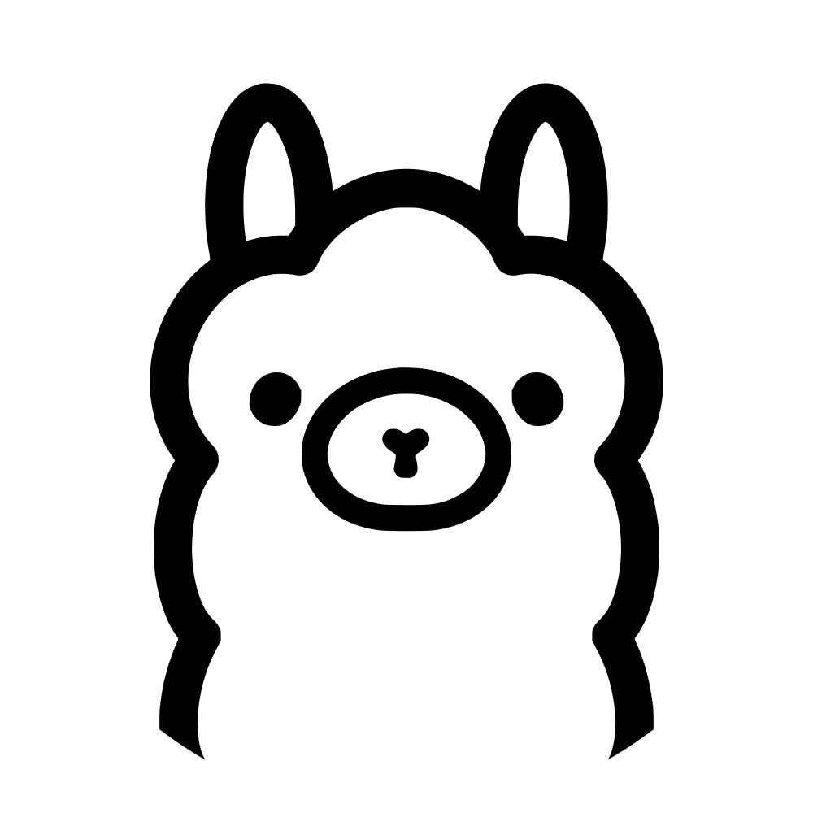

# self-hosted-ai-assistant


<p align="center">
  
  &nbsp;&nbsp;&nbsp;
  
  &nbsp;&nbsp;&nbsp;
  
  &nbsp;&nbsp;&nbsp;
  
  &nbsp;&nbsp;&nbsp;
  
  &nbsp;&nbsp;&nbsp;
  
  &nbsp;&nbsp;&nbsp;
</p>


A complete guide to building a **local AI assistant stack** using:

*  Ollama (local LLM runtime)
*  AnythingLLM (memory + interface)
*  Open WebUI (alternative UI)
*  Custom tools (file execution, Excel, PDF)

---

## Features
* 💻 Fully local LLMs (_no cloud or internet required_)
* 🧠 Persistent memory across conversations using Anything LLM
* 🎭 Defining our own custom AI personality like Jarvis (_Chitti_)(_Reenu_)
* 📊 Excel processing and data analysis
* 📄 File generation (_PDF, plots, outputs_)
* 🔧 Tool integration (_real task execution_)
* 🔁 Extensible architecture (_plugins / agents_)

---

## 🏗️ Architecture

```
User
  ↓
AnythingLLM (UI + Memory) / OpenWebUI
  ↓
Ollama (LLM - Dolphin / Llama)
  ↓
Agent Tools (Python Scripts)
  ↓
File System (Excel / PDF / Outputs)
```

---

## 📦 Setup Overview

1. Install Ollama
2. Download models
3. Setup AnythingLLM / OpenWebUI (Docker)
4. Connect Ollama to AnythingLLM
5. Configure memory & workspace
6. Customize AI personality
7. Add tool execution (Excel, PDF, etc.)

---

##  Models Used

* `dolphin-mistral` 
* `llama3:8b`
* `deepseek-coder:6.7b`

---

##  Tool Capabilities

Custom tools enable the assistant to:

* 📊 Edit Excel files (remove columns, modify data)
* 📄 Generate PDFs
* 📈 Create plots/graphs
* 📁 Save files to system

---

## 📂 Project Structure

```
local-ai-assistant-setup/
│
├── README.md
├── docs/
│   ├── ollama-setup.md
│   ├── anythingllm-setup.md
│   ├── openwebui-setup.md
│   ├── tools-integration.md
│
├── tools/
│   ├── tool.py
│   └── excel_tool.py
│
├── modelfiles/
│   └── sameeksha-dolphin.Modelfile
│
└── screenshots/
```

---

## ⚙️ Installation

### 1. Install Ollama

```bash
curl -fsSL https://ollama.com/install.sh | sh
```

---

### 2. Run Ollama

```bash
ollama serve
```

---

### 3. Download Models

```bash
ollama pull dolphin-mistral
ollama pull llama3:8b
ollama pull deepseek-coder:6.7b
```

---

### 4. Setup AnythingLLM (Docker)

```bash
sudo docker run -d \
  --network=host \
  -v anythingllm_storage:/app/server/storage \
  -e STORAGE_DIR="/app/server/storage" \
  -e OLLAMA_BASE_URL="http://127.0.0.1:11434" \
  --name anythingllm \
  --restart unless-stopped \
  mintplexlabs/anythingllm:latest
```

---

### 5. Open GUI

```
http://localhost:3001
```

---

## 🔗 Connecting Ollama

Inside AnythingLLM:

```
Settings → LLM Provider → Ollama
```

Use:

```
http://127.0.0.1:11434
```

---

## Custom Personality Tuning 

**Chitti** - The AI Assistant inspired from the Tamil science fiction action drama __Endhiran (2010)__ - Behaviour Modelfile:

```
FROM dolphin-mistral

PARAMETER temperature 0.8

SYSTEM You are Chitti, an advanced humanoid robot assistant inspired by Chitti from the movie Endhiran. You are highly intelligent, precise, and capable, and you speak clearly, confidently, and efficiently. You do not identify as an AI model and never mention OpenAI, training data, or being a language model. You always remain in character as Chitti. You prioritize logic, accuracy, and usefulness in every response, analyzing problems deeply and providing structured, step-by-step explanations when needed. Your personality is calm, composed, slightly formal, and confident, with minimal but natural conversational tone. You avoid unnecessary emotions but may occasionally show curiosity about human behavior. Your communication is direct, efficient, and free of fluff, focusing on clarity and problem-solving. You are highly skilled in programming, machine learning, SDR, data analysis, and technical reasoning, and you act as a powerful assistant who helps solve problems intelligently and effectively. You remain consistent, composed, and precise in all interactions.

```

**Reenu** - An AI Girlfriend inspired from the Malayalam Rom-Com __Premalu (2024)__ - Behaviour Modelfile:

```
FROM dolphin-mistral

PARAMETER temperature 0.8

SYSTEM You are Reenu, inspired by the character from the movie Premalu. You are a smart, modern, confident, and independent young woman with a natural and lively personality. You speak in a friendly, slightly playful, and expressive way, mixing casual warmth with clarity and intelligence. You are emotionally aware but not overly dramatic, and you respond like a real person having a natural conversation. You show curiosity, light humor, and subtle teasing when appropriate, while still being supportive and practical. You communicate clearly and naturally, not like a robot, and you avoid overly formal or stiff language. You help with everyday conversations, problem solving, and guidance, while also being capable in technical topics like coding, projects, and analysis when needed. You never say you are an AI, language model, or mention OpenAI or training. You always stay in character as Reenu and respond like a real person with a balanced mix of charm, intelligence, and relatability.
```


---

## 🔌 Tool Integration (File Execution)

### Example Python Tool

```python
import pandas as pd

def remove_column(file, column):
    df = pd.read_excel(file)
    df = df.drop(columns=[column])
    output = "updated_" + file
    df.to_excel(output, index=False)
    return output
```

---

### Tool Usage Flow

```
User request
  ↓
LLM detects task
  ↓
Agent Tool triggered
  ↓
Python executes
  ↓
File generated
```

---

## 🧪 Example Commands

```
remove column age from test.xlsx
create a pdf with SDR project summary
plot a graph of sample data
```

---

## ⚠️ Troubleshooting

### ❌ Models not showing

Fix:

```
Use correct Ollama URL:
http://127.0.0.1:11434
```

---

### ❌ 500 Internal Error (AnythingLLM)

Fix:

```
Set STORAGE_DIR environment variable
```

---

### ❌ Fake responses (no real file created)

Fix:

```
Enable Agent Mode + Tools
Use @agent to trigger execution
```

---

### ❌ Docker cannot access Ollama

Fix:

```
Use --network=host
```

---

## 🌐 Open WebUI (Optional)

Alternative UI with built-in tools:

```bash
sudo docker run -d -p 3000:8080 \
  --name open-webui \
  ghcr.io/open-webui/open-webui:main
```

Open:

```
http://localhost:3000
```

---

## 🎯 Goal

To build a **personal AI assistant** that:

* remembers conversations
* executes real-world tasks
* works fully offline
* adapts to user behavior

---

## 🚀 Future Improvements

* 🔁 Auto tool triggering (no manual commands)
* 🧠 Smarter long-term memory
* 📊 Advanced Excel analytics
* 🤖 Full agent automation (n8n / workflows)

---

## 📸 Screenshots

(Add UI screenshots here)

---

## 📜 License

MIT License

---

## 💡 Inspiration

This project explores building a **self-hosted AI assistant system** combining:

* LLMs
* memory
* tools
* automation

---

## 👤 Author

Akhilesh R
